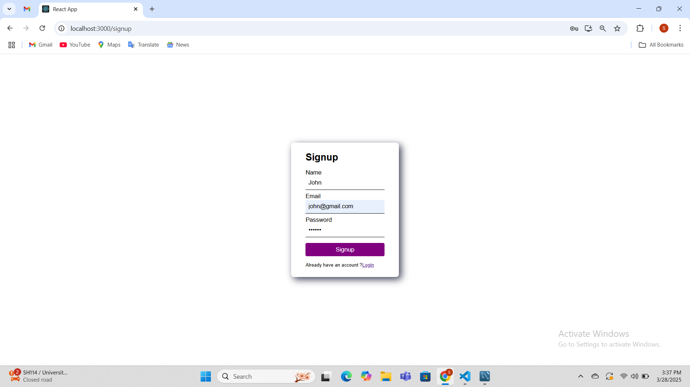

# Task-Manager-Application

# Output 

# Output Video
Output\Task Manager Application.mp4

# Technologies used in the project:

Javascript

React

React-Router

Node-JS

Express-JS

MySQL - Workbench

JWT

# 📁 Folder structure

# Frontend - Holds the client application

public - This holds all of our static files

src

pages - These represent a unique page on the website i.e. Login, Signup.

App.js - This is what renders all of our browser routes and different pages

index.js - This is what renders the react app by rendering App.js.

package.json - Defines npm behaviors and packages for the client

# Backend - Holds the server application

.env - This holds our configuration files, like MySQL

middlewares - This holds all our middlewares used in our application

models - This holds all of our data models or business logic

routes/controllers - This holds all of our HTTP to URL path associations for each unique url

index.js - An entry file for our Node JS application

package.json - Defines npm behaviors like the scripts defined in the next section of the README

.gitignore - Tells git which files to ignore

README - This file!